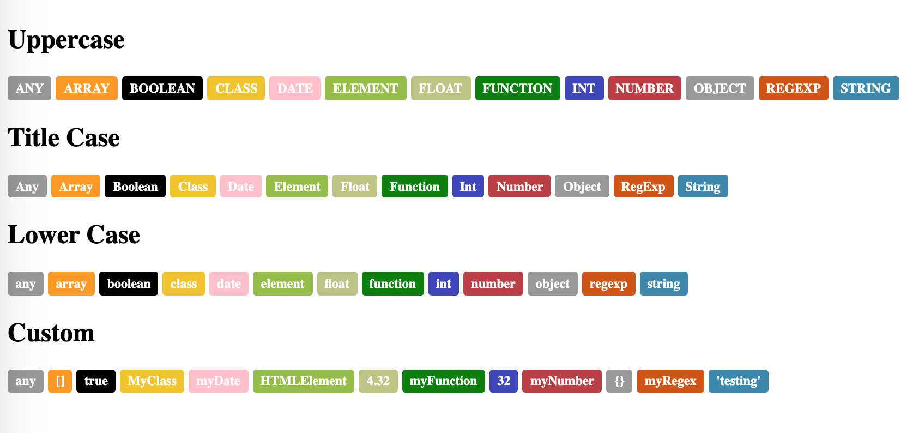

# Python Markdown Extension: typehint

An extension for [Python-Markdown](https://python-markdown.github.io). Replaces `[@TYPENAME]` text with styled "bubble" with a unique color.

## Example Output

